

  

  
  
  
  
  
  

<h3 align="center">La planta completa, trazable pieza por pieza. Sin papel, sin brincarse un proceso y sin detenerse si se cae la red.</h3>

  <a href="#el-problema">El problema</a> ·
  <a href="#la-solución">La solución</a> ·
  <a href="#lo-que-la-hace-diferente">Diferenciadores</a> ·
  <a href="#en-pantalla">En pantalla</a> ·
  <a href="#cómo-funciona">Cómo funciona</a> ·
  <a href="#por-qué-así">Por qué así</a> ·
  <a href="#en-números">En números</a>

  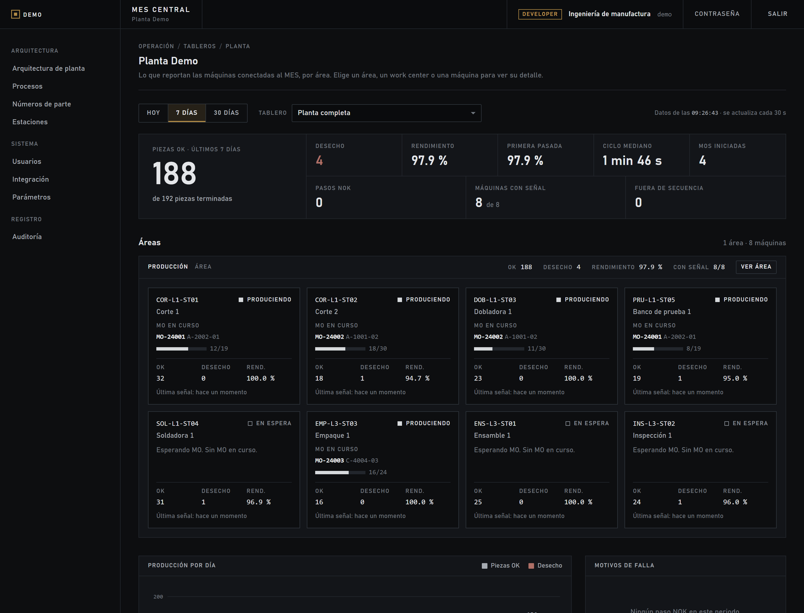

---

## El problema

En una planta de manufactura con decenas de máquinas y cientos de números de parte, cada pieza pasa por varios procesos en un orden que no se puede romper. Hoy, en la mayoría de las plantas:

- **El orden depende de la memoria del operador.** Una orden de manufactura (MO) puede llegar a la prueba final sin haber pasado por soldadura, y nadie se entera hasta que lo reclama el cliente.
- **La trazabilidad vive en papel y en hojas de cálculo.** Para responder «¿quién hizo esta pieza, con qué receta y quién lo autorizó?» se pierden horas.
- **Cada máquina tiene su propia aplicación**, hecha a su manera. Unirlas o auditarlas es un proyecto en sí mismo.
- **Nadie ve la planta en tiempo real.** Cuántas piezas pasaron, cuántas no, dónde va cada MO: se sabe al final del turno, cuando ya no hay nada que corregir.
- **La red falla.** Y cuando falla, la producción no puede parar.

## La solución

**Trazabilidad Operativa** son dos aplicaciones que trabajan juntas y una carpeta que las une:

  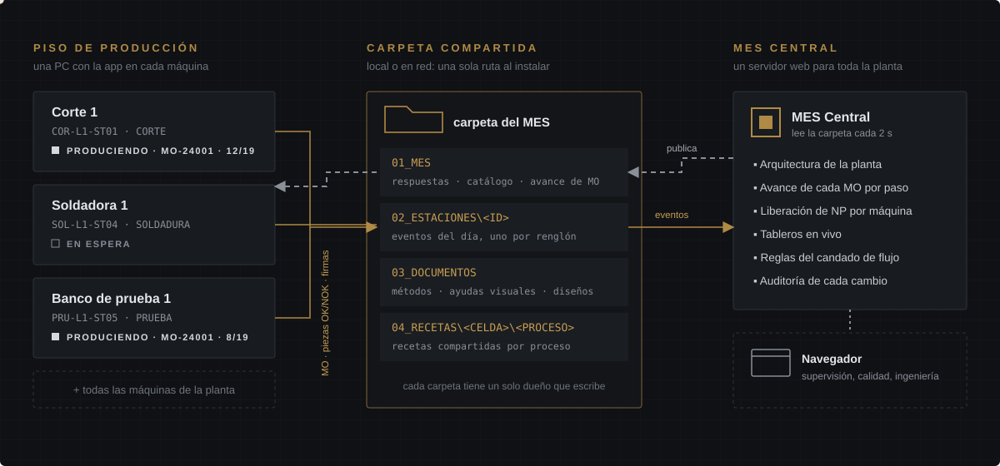

| | App de estación | MES Central |
|---|---|---|
| **Dónde corre** | En la PC de cada máquina | En un servidor, se usa desde el navegador |
| **Qué hace** | Registra cada MO, cada pieza OK/NOK, cada firma y cada cambio. Guía al operador y **no deja arrancar una MO fuera de su flujo** | Junta lo de todas las máquinas: arquitectura de la planta, avance de cada MO por paso, liberación de números de parte y tableros en vivo |
| **Sin red** | Sigue produciendo: todo espera en su cola local y se envía al volver | Sigue mostrando lo último recibido y se pone al día solo |
| **Para quién** | Operadores, supervisores, calidad, mantenimiento | Ingeniería, calidad, supervisión y gerencia |

---

## Lo que la hace diferente

<table>
<tr>
<td width="50%" valign="top">

### Candado de flujo
Una MO **no puede brincarse un proceso**. El siguiente proceso solo arranca cuando el anterior ya aprobó al menos **2 piezas OK**, y ninguna máquina procesa más piezas de las que el paso anterior aprobó. La revisión ocurre **en la máquina, antes de la pieza**, no en un reporte al día siguiente.

</td>
<td width="50%" valign="top">

### Funciona sin red
Cada máquina es dueña de su registro y trabaja sola. Si se cae la red, la producción sigue; los eventos esperan en una cola local y llegan completos, en orden y sin duplicados cuando vuelve. Si no se puede comprobar el flujo, la MO solo arranca **con firma de supervisor**, y el MES recibe el aviso.

</td>
</tr>
<tr>
<td valign="top">

### Cero infraestructura nueva
Las aplicaciones se hablan por **una carpeta compartida**: local o en red, se elige una sola vez al instalar. No hacen falta brokers, colas ni servidores de mensajería. Cada subcarpeta tiene un solo dueño que escribe, así nada se revuelve.

</td>
<td valign="top">

### Lista para auditoría
Registro **inmutable**: la propia base de datos impide editar o borrar los pasos, los eventos y las firmas. **Firmas electrónicas** con significado legal, **auditoría encadenada** con hash que detecta alteraciones y una foto de arranque de cada MO (receta, herramental, calibración, versión). Orientado a **21 CFR Part 11**.

</td>
</tr>
<tr>
<td valign="top">

### Una plantilla para todas las máquinas
Acceso, firmas, auditoría, MO, recetas, respaldos y conexión con el MES ya vienen hechos. **Lo único que se escribe por máquina es su ciclo**: un archivo. Cada máquina nueva arranca con todo lo común ya probado, y todas hablan el mismo idioma.

</td>
<td valign="top">

### La planta, en Excel y en diagrama
Áreas, celdas, work centers, procesos, flujos y sus números de parte se editan en un **diagrama** o en **Excel de ida y vuelta**: el MES revisa altas, cambios y bajas antes de guardar, y todo queda auditado.

</td>
</tr>
<tr>
<td valign="top">

### Liberación de NP por máquina
Cada máquina libera sus números de parte con **tres firmas** (Calidad, Manufactura, Producción). El MES muestra, NP por NP y máquina por máquina, qué está liberado, qué falta y si **cada paso del flujo** tiene al menos una máquina lista para producir. El reporte en Excel sale con un clic.

</td>
<td valign="top">

### Procesos que se repiten
Si el flujo pasa dos veces por el mismo proceso (corte, soldadura, **corte otra vez**), la MO vuelve a la misma máquina en una **segunda pasada**, con las mismas reglas. Cada pasada queda como evidencia separada.

</td>
</tr>
</table>

---

## En pantalla

> Todas las capturas usan una **planta de demostración**: nombres, números de parte y datos son ficticios.

### MES Central

<table>
<tr>
<td width="50%">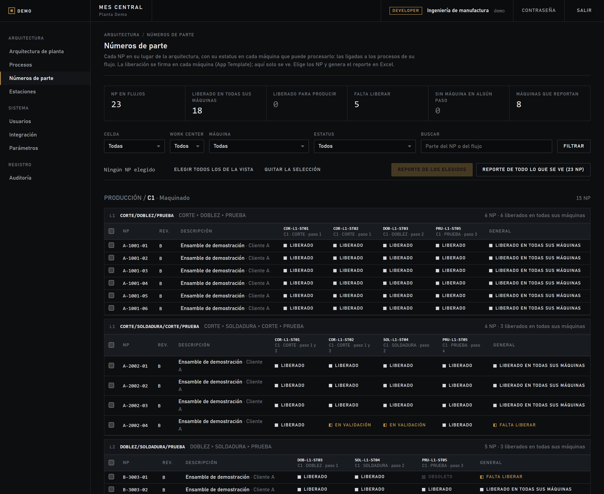 <b>Liberación de NP por máquina.</b> Cada NP en su lugar de la arquitectura, con su estatus en cada máquina que puede procesarlo y un estatus general. Se eligen NP y se genera el reporte.</td>
<td width="50%">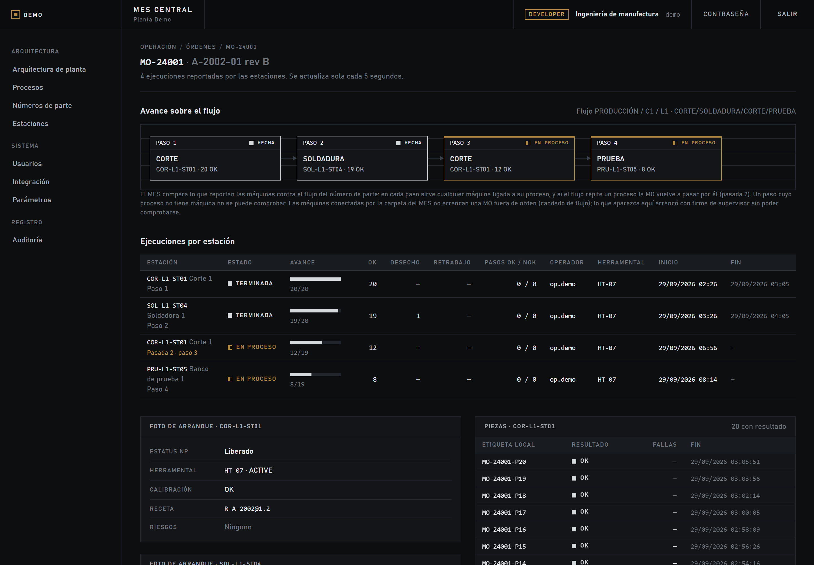 <b>Avance de cada MO por paso.</b> Qué máquina hizo cada paso, cuántas piezas pasaron y cuántas no, y la <b>pasada 2</b> cuando el flujo repite un proceso.</td>
</tr>
<tr>
<td width="50%">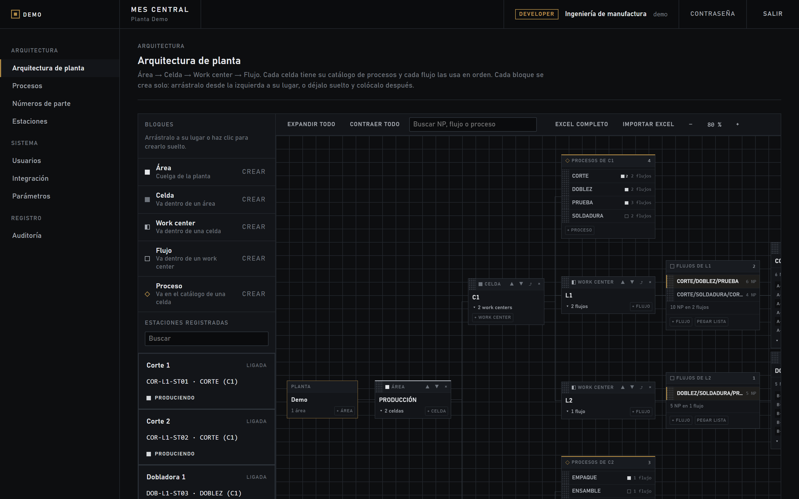 <b>La planta como diagrama.</b> Área, celda, work center, flujo y el catálogo de procesos de cada celda, con las máquinas que reportan por cada uno.</td>
<td width="50%">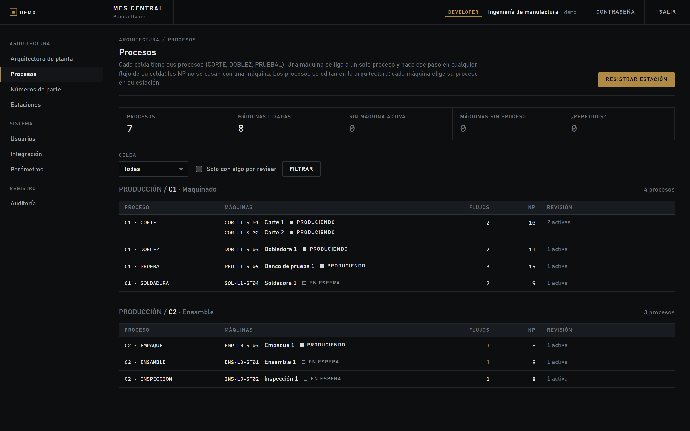 <b>Procesos y máquinas.</b> Cada proceso con sus máquinas y su estado; avisa si un proceso que usan los flujos se quedó sin máquina activa.</td>
</tr>
</table>

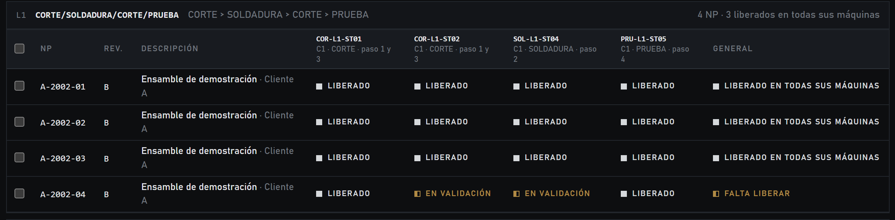

### App de estación

<table>
<tr>
<td width="50%">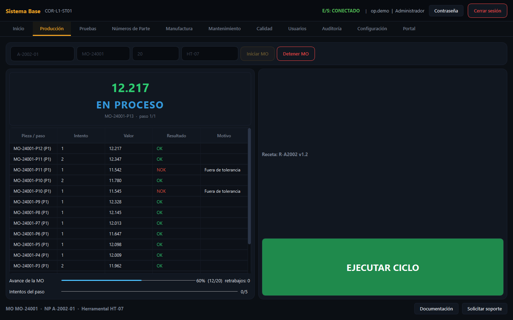 <b>Producción.</b> MO en curso, cada ciclo con su valor medido y su resultado, intentos por paso, avance y un solo botón grande para el operador.</td>
<td width="50%">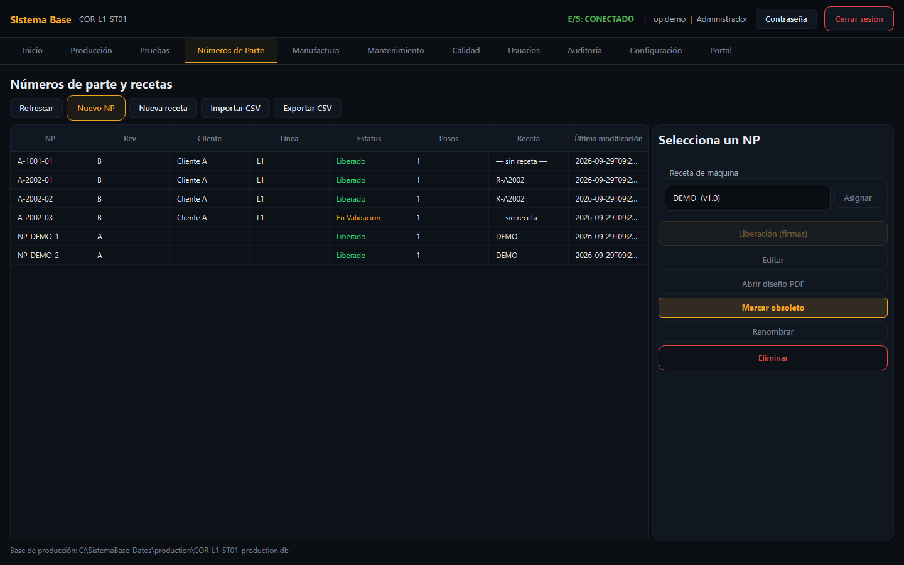 <b>Números de parte y recetas.</b> Liberación con tres firmas, receta de máquina por NP y diseño del NP a un clic.</td>
</tr>
<tr>
<td width="50%">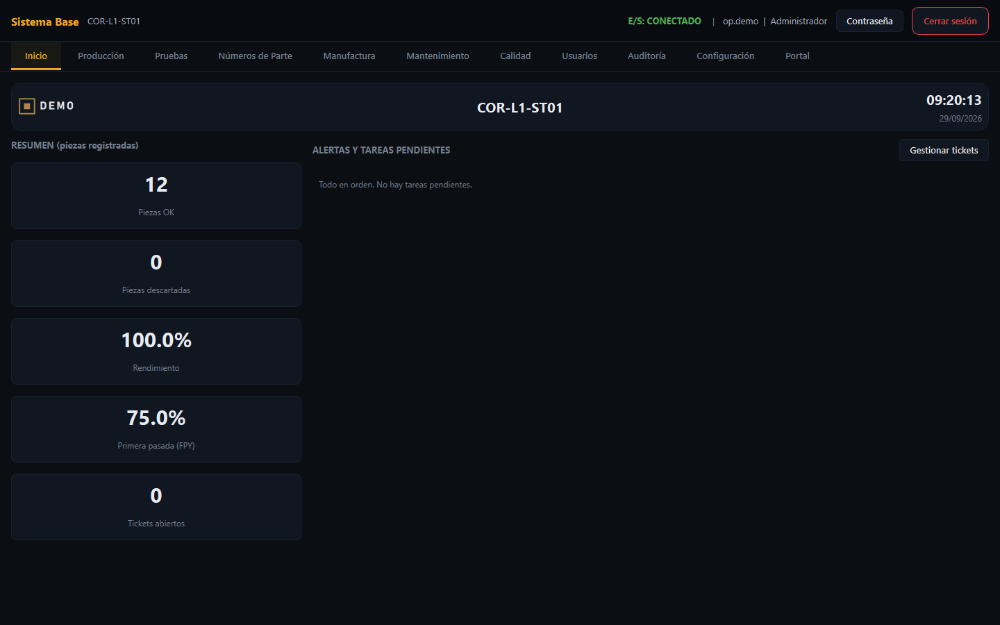 <b>Inicio.</b> Piezas OK, desecho, rendimiento, primera pasada y los pendientes de la estación.</td>
<td width="50%">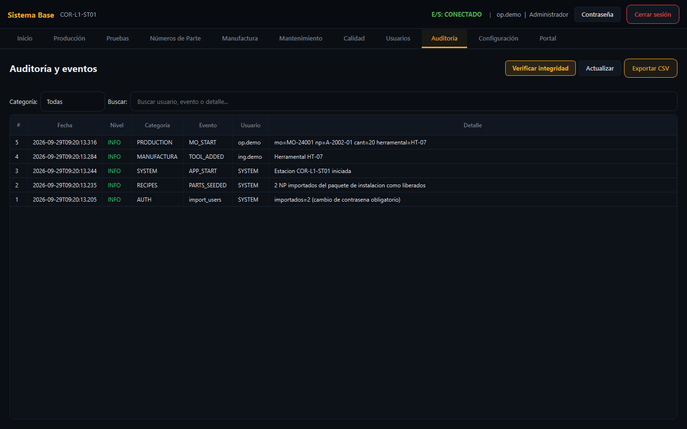 <b>Auditoría.</b> Cada acción con quién, cuándo y qué; la cadena de hash se verifica con un botón.</td>
</tr>
</table>

---

## Cómo funciona

### El recorrido de una MO

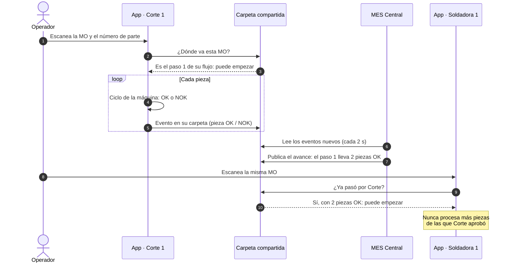

### El candado de flujo

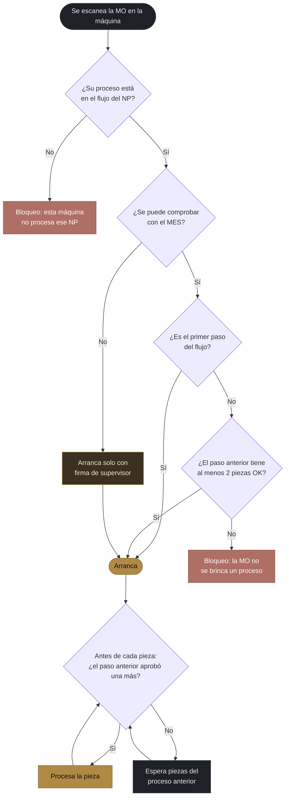

### Cuando el flujo repite un proceso

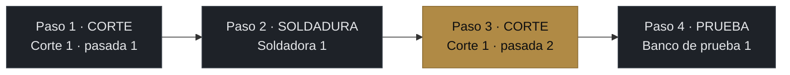

La misma máquina vuelve a procesar la MO solo si su flujo repite el proceso **después** del último paso que ella hizo, y con las mismas reglas del candado. Cada máquina dice qué paso hace; el MES lo registra y así el avance nunca se confunde.

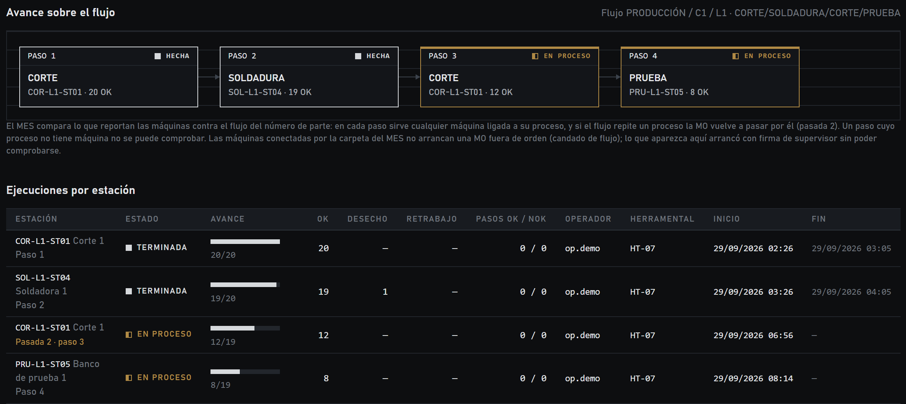

---

## Por qué así

**Cada máquina es la fuente de verdad.** Lo que se hizo en una máquina queda primero en esa máquina, en una base propia protegida contra cambios. El MES consolida, pero nunca escribe en una máquina: si el MES se apaga, ninguna pieza se pierde.

**Una carpeta en lugar de un servidor de mensajería.** La planta ya tiene carpetas compartidas y personas que saben cuidarlas. Cada máquina escribe solo en la suya, con escrituras atómicas, y los eventos solo se agregan. Es simple de operar, de respaldar y de auditar. Si mañana la planta necesita un broker (MQTT), el contrato de eventos ya está listo para esa vía.

**La regla se revisa donde se puede impedir.** Un reporte de «MO fuera de secuencia» al día siguiente no evita el scrap; el candado en la máquina, antes de cada pieza, sí. El MES también detecta y marca lo que haya arrancado sin poder comprobarse.

**Dos piezas OK, no la MO completa.** Esperar a que un proceso termine toda la MO para empezar el siguiente frena la línea. Con 2 piezas aprobadas el flujo arranca en paralelo, y el tope por paso garantiza que ninguna pieza se brinque un proceso.

**Una sola plantilla.** Cuando todas las máquinas comparten el mismo núcleo, unir sus datos, auditarlas y mejorarlas cuesta lo mismo para una que para cien. Cada repositorio trae instrucciones para que los asistentes de IA del equipo trabajen dentro de las reglas y no cambien de más.

**Cumplimiento desde el diseño.** Firmas con significado, registros que no se pueden alterar, auditoría encadenada, foto de arranque de cada MO y política de autorizaciones en una sola tabla. No es un módulo que se agrega al final.

---

## En números

<table>
<tr>
<td align="center" width="20%"><h2>305</h2>pruebas automáticas en verde</td>
<td align="center" width="20%"><h2>2–5 s</h2>de la pieza terminada a verla en el MES</td>
<td align="center" width="20%"><h2>10–60 ms</h2>por página del MES, con la base en red</td>
<td align="center" width="20%"><h2>1,600+</h2>números de parte en 230+ flujos, probados</td>
<td align="center" width="20%"><h2>0</h2>servidores de mensajería nuevos</td>
</tr>
</table>

---

## Tecnología

| Capa | App de estación | MES Central |
|---|---|---|
| Lenguaje | Python 3.11 | Python |
| Interfaz | PySide6 (Qt 6), pantalla táctil | FastAPI + Jinja2, HTML sin dependencias externas y con CSP estricta |
| Datos | SQLite (WAL) con esquema versionado y *triggers* de inmutabilidad | SQLAlchemy 2; SQLite hoy, SQL Server como destino |
| Seguridad | bcrypt, bloqueo por intentos, cierre por inactividad, DPAPI para secretos | Perfiles, CSRF, sesiones con vencimiento, auditoría de cada cambio |
| Integración | Carpeta compartida (eventos `traz.event/1.0`), Modbus TCP, MQTT, SSE | Ingesta idempotente con cuarentena, publicación a las máquinas |
| Operación | Instalación sin internet, respaldo diario verificado, paquete de planta con compuerta de pruebas | Un MES por planta, arranque con una sola ruta |

## Estado

**Funcionando hoy:**
- las dos aplicaciones de punta a punta, con la carpeta compartida;
- candado de flujo, con pasadas por procesos repetidos;
- liberación de NP por máquina, con su reporte;
- arquitectura de la planta en diagrama y en Excel;
- tableros, firmas electrónicas y auditoría.

**Lo que sigue:**
- piloto en máquinas reales;
- SQL Server y usuarios del directorio corporativo;
- planta en vivo (streaming) y trazabilidad por MO;
- desviaciones con reconciliación;
- tableros Andon;
- validación IQ/OQ/PQ.

---

## Sobre este repositorio

Este repositorio **presenta** el proyecto. El código fuente vive en repositorios privados. Las capturas se generaron con una planta de demostración: ningún dato corresponde a una planta real.

¿Te interesa el proyecto o quieres verlo funcionando? Escríbeme: **[@marioDuran0607](https://github.com/marioDuran0607)**.

<b>English summary</b>

**Trazabilidad Operativa** is a manufacturing traceability platform made of two applications joined by a shared folder:
- a **station app** (PySide6) that runs on every machine's PC and records each manufacturing order, each good or bad piece, electronic signatures and a tamper-evident audit trail, fully offline-capable;
- a **central MES** (FastAPI) that consolidates every machine: plant architecture, per-step order progress, part-number release per machine and live dashboards.

Its **flow lock** stops an order from skipping a process: the next process can start only when the previous one has approved at least two good pieces, and no machine may process more pieces than the previous step approved. It supports repeated processes (a second pass on the same machine), works when the network is down (supervisor signature when the flow cannot be checked) and is designed with 21 CFR Part 11 in mind. The source code is private; all screenshots use fictional demo data.

